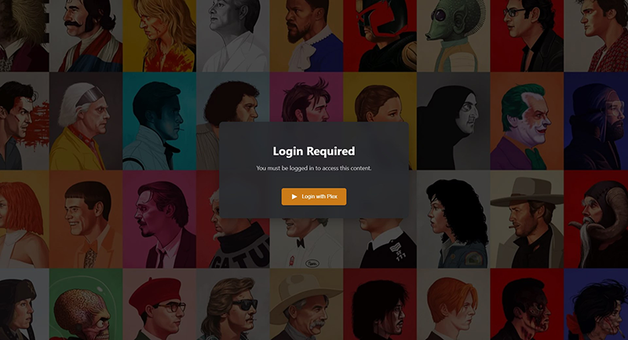

# Plex Documentation Guide



A standardized documentation template for your Plex server, built with Material for MkDocs and deployed via Cloudflare Pages. This template includes pre-built pages covering common Plex topics like streaming quality, content requests, transcoding, and more, all of which are protected via Plex OAuth so only your users can read them.

This documentation project contains the same content as [mkdocs-plex-guide-template](https://github.com/MisterCalvin/mkdocs-plex-guide-template), but with a different deployment configuration. To see an example of the docs, take a look at the GitHub Pages [example site](https://mistercalvin.github.io/mkdocs-plex-guide-template/).

## ✨ Features
- 📚 Pre-built pages for common Plex topics
- 🔄 Automatic deployment via Cloudflare Pages
- 🎨 Material for MkDocs theme with custom styling
- 🔒 Docs are protected via Plex OAuth (only users with access to your Plex server can view)

## Deployments

The project uses Cloudflare Pages' Git integration for automatic deployments. When you push to your configured branch (default: main), Cloudflare will:

1. Detect the changes in your repository
2. Pull the latest code
3. Run the build command (`git fetch --unshallow && mkdocs build`)
4. Deploy the built files to Cloudflare's global network

Each commit creates a unique deployment with its own URL, and successful builds on the production branch are automatically published to your primary domain.

For more information about the Git integration and deployment process, see the [Cloudflare Pages Git Integration documentation](https://developers.cloudflare.com/pages/configuration/git-integration/).

## 🔒 Security Considerations

### Asset Access
For performance and resource optimization, certain static assets are intentionally excluded from authentication checks (defined in [`functions/_routes.json`](functions/_routes.json)). This means files in the following paths are publicly accessible:
- `/assets/css/*`
- `/assets/js/*`
- `/assets/images/*`
- `/assets/video/*`
- Root-level CSS/JS files and favicons

This design choice:
- Reduces authentication processing overhead
- Minimizes API requests
- Helps stay within Cloudflare Pages' [free tier limits](#-cloudflare-pages-free-tier-usage-limits) (100,000 requests/day)

> [!NOTE]
> While these assets are accessible without authentication, they are not easily discoverable unless someone knows the exact file paths. However, if your documentation includes sensitive images or media files, consider storing them in a different location or enabling authentication for specific asset paths.

## Quick Links
- [🚀 Getting Started](#-getting-started)
- [⚙️ Configure Cloudflare Pages](#2-️-configure-cloudflare-pages)
- [📄 MkDocs Configuration](#3--mkdocs-configuration)
- [➕ Additional Steps](#4--additional-steps)
- [🎨 Customization](#-customization)
- [🔧 Troubleshooting](#-troubleshooting)
- [💻 Cloudflare Pages Free Tier Usage Limits](#-cloudflare-pages-free-tier-usage-limits)
- [📚 Resources](#-resources)

## 🚀 Getting Started

### 1. Create GitHub Repository
1. Create a new repository from this template
2. Clone your new repository locally
3. Follow the steps below, then push your documentation to the repository

### 2. ⚙️ Configure Cloudflare Pages

1. Go to Cloudflare Dashboard → Compute (Workers) → Workers & Pages
2. Click "Create" → "Pages" → "Connect to Git"
3. Select your GitHub repository
4. Configure build settings:
   - Framework present: `None`
   - Build command: `git fetch --unshallow && mkdocs build`
   - Build output directory: `site`
   - Root directory: (leave empty)
   - Build comments: Enabled

5. Add environment variables:

> [!WARNING]
> ### Secrets
> You can add your Secrets as Variables on the same page when configuring your build settings, but once your pages application is deployed be sure to go into "Settings" → "Variables and Secrets" and change your `PLEX_SERVER_ID, PLEX_CLIENT_ID, MKDOCS_GIT_COMMITTERS_APIKEY` variables to `Secret`, otherwise they will be printed as plaintext in any logs.

   | Type | Name | Value | Description |
   |------|------|-------|-------------|
   | Text | `COOKIE_NAME` | plex_session | Name for the authentication cookie |
   | Text | `DEBUG` | false | Enable debug logging |
   | Secret | `PLEX_SERVER_ID` | Machine ID | Your Plex server's machine identifier ([see below](#finding-your-plex-server-id)) |
   | Secret | `PLEX_CLIENT_ID` | UUID | Your generated application ID ([see below](#generating-a-plex-client-id)) |
   | Secret | `MKDOCS_GIT_COMMITTERS_APIKEY` | GitHub Token | Optional: For showing git contributors ([see below](#github-fine-grained-access-token-optional)) |

> [!NOTE]
> The first deployment will fail, as `mkdocs.yml` contains placeholder values we need to update
>
> The failure occurs because we need to know the Cloudflare Pages domain (`your-project-name.pages.dev`) before we can properly configure `mkdocs.yml`. The recommended setup order is:
>
> 1. Connect your repository to Cloudflare Pages and attempt the first deployment
> 2. Note your assigned `*.pages.dev` domain
> 3. Update `mkdocs.yml` with the correct domain values
> 4. Push your changes to trigger a new deployment
>
> If you're experienced with Cloudflare Pages and already know your `*.pages.dev` domain (or are intend to use a [custom domain](#-custom-domain-optional)), you can update `mkdocs.yml` before connecting your repository.

### 3. 📄 MkDocs Configuration

The [`mkdocs.yml`](mkdocs.yml) file controls your documentation settings. You'll need to update several values for your deployment:

1. Basic Settings:
```yaml
site_name: your-site-name  # e.g., guide.plex.yourdomain.com
site_url: https://your-domain.com
```

2. Theme Configuration:
```yaml
theme:
  logo: assets/images/plex-logo.webp  # Replace with your logo
```

3. Git Committers Plugin (if using):
```yaml
plugins:
  - git-committers:
      repository: YourUsername/your-repo-name
      branch: main  # Or your default branch
      exclude_committers:
        - "web-flow"  # GitHub web UI edits
        - "actions-user"  # GitHub Actions
        - "github-actions[bot]"  # GitHub Actions bot
      token: !ENV GITHUB_TOKEN
```

4. Social Links:
```yaml
extra:
  social:
    - icon: fontawesome/brands/github
      link: https://github.com/yourusername
      name: Your Name @ Github
    - icon: fontawesome/brands/discord
      link: https://your-discord-link
      name: Discord Channel
    - icon: fontawesome/solid/globe
      link: https://your-website.com
      name: Personal Website
```

5. Copyright Notice:
```yaml
copyright: Copyright &copy; 2025 Your Name
```

> [!NOTE]
> The navigation structure (`nav:`) can also be customized to match your documentation needs. You can add, remove, or reorganize pages as needed.
> Check the MKDocs links in the [Resources](#-resources) section at the bottom for more information

6. Trigger initial build and test:
    - Push the updated mkdocs.yml to your repository to trigger a build
    - Once deployed, visit your Pages URL (shown at the top of your project's dashboard as *.pages.dev)
    - Confirm you're redirected to Plex login
    - After logging in, verify you can access the documentation

### 4. ➕ Additional Steps

#### Finding Your Plex Server ID
You can find your Server ID by visiting:
- `https://your-plex-server:32400/identity`
- Look for the `machineIdentifier` field

#### Generating a Plex Client ID
1. Generate a UUID v4:
   - You can use an online [UUID generator](https://www.uuidgenerator.net/)
   - Or use this command:
     ```bash
     python3 -c 'import uuid; print(uuid.uuid4())'
     ```
2. Add the generated UUID as a Secret environment variable named `PLEX_CLIENT_ID` in your Pages settings

#### GitHub Fine-Grained Access Token (Optional)
> [!NOTE]
> The git committers plugin is optional. If you don't need to show document contributors at the bottom of each documentation page, you can skip this step entirely.

1. Navigate to your [Fine-grained Personal access tokens](https://github.com/settings/personal-access-tokens) (`GitHub → Settings → Developer settings → Personal access tokens → Fine-grained tokens`)
2. Click "Generate new token"
3. Configure the token:
   - Token name: "Plex Guide (Git Committers API Key)"
   - Repository access: Select "Only select repositories"
   - Select your documentation repository
   - Permissions:
     - Repository permissions:
       - Contents: Read-only
       - Metadata: Read-only
4. Add the token as `MKDOCS_GIT_COMMITTERS_APIKEY` in your Pages environment variables

## 🎨 Customization

### Content Customization
Key files to modify:
- `docs/*.md` - Documentation pages
- `docs/assets/css/extra.css` - [Custom admonitions](https://squidfunk.github.io/mkdocs-material/reference/admonitions/#custom-admonitions)
- `docs/assets/` - Images, videos, Style Sheets, and JavaScript
- `functions/` - Cloudflare Pages functions

### 🔗 Custom Domain (Optional)
1. Go to your Pages project → Settings → Custom domains
2. Click "Set up a custom domain"
3. Follow the prompts to add and verify your domain
4. Once verified, your Plex auth and documentation will automatically use the new domain

### Preview Deployments

Cloudflare Pages creates unique URLs for each deployment, including preview deployments from non-main branches. By default, these use the format `<hash>.pages.dev`.

For convenience during development, it's recommended to set up a custom domain for your preview branch:

1. Go to your Pages project → Settings → Custom domains
2. Click "Add custom domain"
3. Enter your preview domain (e.g., `dev.guide.plex.yourdomain.com`)
4. Under "Branch", select your development branch (e.g., `development`)
5. Follow the prompts to verify the domain

This avoids having to re-authenticate with Plex each time you deploy to a preview branch, as the authentication is tied to the domain. Without a custom preview domain, you would need to log in again for each new `<hash>.pages.dev` URL.

> [!NOTE]
> ### Branch Domain Structure
> You can use different subdomains for different branches:
> - Production (main): `guide.plex.yourdomain.com`
> - Development: `dev.guide.plex.yourdomain.com`
> - Feature branches: `staging.guide.plex.yourdomain.com`

### Authentication Page Styling

The login page can be customized by modifying two main files:

1. Background Image: [`docs/assets/images/auth/bg.webp`](docs/assets/images/auth/bg.webp)
   - Replace this file with your own background image
   - Recommended size: 1080x1200px (will automatically fit different devices)
   - Format: WebP preferred for optimal loading

2. Styling: [`docs/assets/css/auth.css`](docs/assets/css/auth.css)
   - Contains all styling for the authentication pages
   - Customize colors, fonts, animations, and layout

#### Removing the Background Image

If you prefer a solid color background, modify the CSS in [docs/assets/css/auth.css](docs/assets/css/auth.css):

1. Add the base background color to the html element:
```css
html {
  background: #282a2d;
}

body {
  font-family: -apple-system, system-ui, BlinkMacSystemFont, 'Segoe UI', Roboto, 'Helvetica Neue', Arial, sans-serif;
  display: flex;
  justify-content: center;
  align-items: center;
  min-height: 100vh;
  margin: 0;
  background: #282a2d;  /* Solid color instead of image */
  color: white;
  -webkit-text-size-adjust: 100%;
}
```

## 🔧 Troubleshooting

### Viewing Logs

To view logs and debug authentication issues:

1. Go to Cloudflare Dashboard → Compute (Workers) → Workers & Pages → Your Pages project
2. From the "Deployments" tab, click on your latest deployment at the top of the page
3. Click "View details"
4. Navigate to the "Functions" tab
5. Click "Begin log stream" to view real-time logs

For more detailed logging, set the `DEBUG` environment variable to `true` in your Pages settings. This will output additional information about:
- Authentication attempts
- Server access checks
- Resource validation
- Request processing

> [!WARNING]
> Environment variables require a new deployment to take effect. After enabling `DEBUG`, go to Deployments → Latest deployment → Click `...` next to "View Details" → "Retry deployment". Remember to redeploy again after setting `DEBUG` back to `false` to disable logging in production.
>
> Each deployment counts toward your free plan limit of [500 builds per month](#-cloudflare-pages-free-tier-usage-limits)

Take a look at the Cloudflare Pages docs on [Debugging Pages](https://developers.cloudflare.com/pages/configuration/debugging-pages/) for more.

### CSS/JS Changes Not Appearing

If changes to CSS or JavaScript files are not showing up after deployment:
1. Go to Cloudflare Dashboard → Websites → Your domain → Caching
2. Click "Configuration"
3. Select "Custom Purge" and enter the paths to your CSS/JS files:
    - `https://your-domain.com/assets/css/auth.css`
    - `https://your-domain.com/assets/js/auth.js`
    (Replace your-domain.com with your actual domain)

This will force Cloudflare to fetch the latest versions of these files.

> [!TIP]
> ### Browser Cache
> Sometimes your browser might cache CSS/JS files. If you're still not seeing changes after purging Cloudflare's cache, try a hard refresh (Ctrl+F5) in your browser.

## 💻 Cloudflare Pages Free Tier Usage Limits

### Free Plan Limits
- **Functions Requests**: 100,000 per day (resets at midnight UTC)
  - This includes any requests that go through authentication
  - Static assets (CSS, images, etc.) are unlimited and free
- **Builds**: 500 per month
  - Each push to your repository counts as a build
  - Builds timeout after 20 minutes
- **Custom Domains**: 100 per project
- **Files**: Maximum 20,000 files per site
- **File Size**: 25 MiB per file

> [!TIP]
> ### Upgrading to Pro
> If you need higher limits, you can upgrade to Pro by:
> 1. Having any domain on Cloudflare with a Pro plan or higher
> 2. That domain doesn't need to use Pages - it just needs to be on a Pro plan
>
> See the [community discussion](https://community.cloudflare.com/t/how-to-buy-pro-plan-for-cf-pages/667975/5) for more details.

For more information, see:
- [Cloudflare Pages Limits](https://developers.cloudflare.com/pages/platform/limits/)
- [Static Asset Requests](https://developers.cloudflare.com/pages/functions/pricing/#static-asset-requests)
- [Functions Invocation Routes](https://developers.cloudflare.com/pages/functions/routing/#functions-invocation-routes)

## 📚 Resources

### Documentation / Plugins
- [Cloudflare Pages Docs - Overview](https://developers.cloudflare.com/pages/)
- [Cloudflare Pages Docs - Add a custom domain to a branch](https://developers.cloudflare.com/pages/how-to/custom-branch-aliases/)
- [Cloudflare Pages Docs - Preview deployments](https://developers.cloudflare.com/pages/configuration/preview-deployments/)
- [Material for MkDocs - Getting started](https://squidfunk.github.io/mkdocs-material/getting-started/)
- [MkDocs Plugins Catalog](https://github.com/mkdocs/catalog)

### Video Tutorials
- [Hosting MkDocs on Cloudflare Pages](https://www.youtube.com/watch?v=7-HhLascLuM) - Techdox

### Plex OAuth Docs (For Developers)
- [Authenticating with Plex](https://forums.plex.tv/t/authenticating-with-plex/609370)
- [Security alert when authenticating with Plex](https://forums.plex.tv/t/security-alert-when-authenticating-with-plex/887330)
