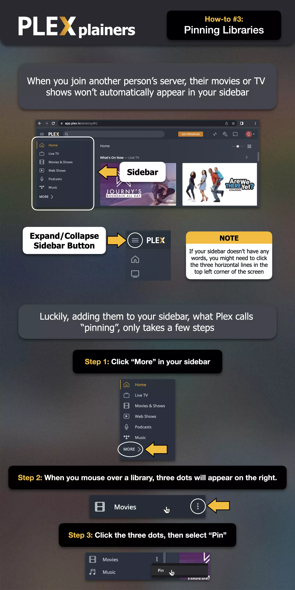
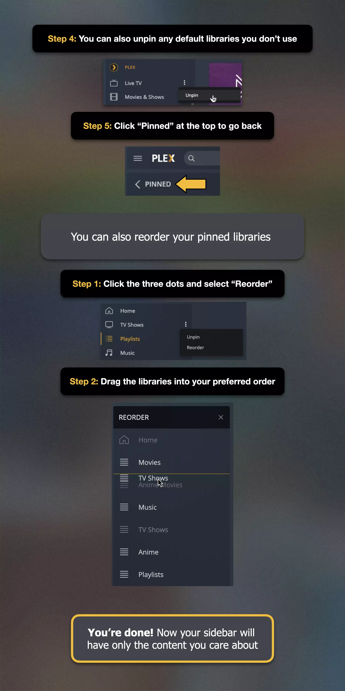

# Connecting to the Server

Welcome! This guide explains how to connect your devices to the media server. As we are transitioning from Plex (*Mahadev*) to Jellyfin (*Parvati*) (see [Why Jellyfin?](why-jellyfin.md)), the primary connection method is now via Jellyfin.

[TOC]

## Connecting with Jellyfin (Primary Method)

Jellyfin doesn't use a central invite system like Plex. To connect any Jellyfin app (on your phone, TV, computer, etc.) to the *Parvati* server, you simply need to tell the app the server's address.

**Server Address:**
https://jellyfin.bladelight.tech
**General Steps (May vary slightly by app):**

1.  **Install a Jellyfin Client App:**
    * Download the official Jellyfin app appropriate for your device. Common sources include:
        * Google Play Store (Android Phones/Tablets, Android TV/Google TV)
        * Apple App Store (iPhone, iPad, Apple TV - *Note: Consider using [Swiftfin](https://github.com/jellyfin/Swiftfin) for a more native experience*)
        * Amazon Appstore (Fire TV devices)
        * [Jellyfin Website](https://jellyfin.org/downloads/) (for Desktop apps like Jellyfin Media Player for Windows/macOS/Linux)
        * Roku Channel Store

2.  **Open the App:** Launch the Jellyfin app for the first time.

3.  **Add Server / Connect:** Look for an option like "Add Server," "Connect to Server," or similar prompts.

4.  **Enter Server Address:** When asked for the server address or URL, carefully type in the address exactly as shown above.
    !!! important "Address Details"
        * Ensure you include `https://` at the beginning.
        * Do **not** add anything after `.tech` (like port numbers or extra slashes).
        * Check carefully for typos.

5.  **Connect / Continue:** Proceed with the connection (e.g., tap "Connect", "Next", or "Save"). The app should find and confirm the server connection.

6.  **Login:** You will then be prompted to enter your **Jellyfin Username** and **Password**.
    * If you previously used Plex to log into this guide (`help.bladelight.tech`), you likely need a new Jellyfin account. Please contact me (the server admin) via Email, Signal, WhatsApp, or SMS/iMessage for an **access code**.
    * Once you have the access code, go to **[join.bladelight.tech](https://join.bladelight.tech)** *(<- Assuming this is the correct URL for your invite tool)* and follow the instructions to create your user account.
    * **Important:** Please use your **Full Name** as your username during signup, otherwise your account may be removed.
    * If you already have Jellyfin credentials, use those.

7.  **Done!** Once logged in, you should see the *Parvati* server's media libraries. Explore the app's settings (see [Client Playback Settings](client-settings.md)) to ensure optimal video quality!

!!! failure "Connection Problems?"
    * **Check Server Address:** Double-check the address `https://jellyfin.bladelight.tech` for typos.
    * **Check Internet:** Ensure your device has an active internet connection.
    * **Check Credentials:** Verify your username and password. If you just created an account via the join link, ensure it was successful.
    * **Contact Admin:** If problems persist, please reach out for assistance using the methods listed on the [Requests & Issues](requests-and-issues.md#contacting-the-admin) page.

## Connecting with Plex (During Transition / Phasing Out)

While Jellyfin (*Parvati*) is the primary way forward, Plex (*Mahadev*) access remains available during the transition period until **July 1st, 2025**.

* **Access:** Requires a prior invitation accepted via [plex.tv](https://plex.tv). If you previously had access, it should still work. New access is generally not being granted via Plex.
* **Pinning Libraries (Important Plex Step):** If using Plex, you likely need to manually "pin" the shared libraries (*Mahadev*'s Movies, TV Shows, etc.) to your Plex sidebar and potentially unpin Plex's own online sources to avoid confusion. Follow these steps in the Plex app (Web, Desktop, or TV):
    1.  Look for the server name (*Mahadev*) in your list of sources, possibly under a "More" or similar menu option.
    2.  Hover over or select a library you want quick access to (e.g., Movies).
    3.  Click the **three dots (...)** or find the **Pin** option. Select **Pin**.
    4.  Repeat for other desired libraries (TV Shows, etc.).
    5.  *(Recommended)* Find Plex's own sources (like "Live TV", "Movies & Shows on Plex") in the sidebar, click the three dots (...), and select **Unpin** to hide them.
    6.  You can reorder your pinned libraries by clicking and dragging them in the sidebar settings.

    
    

* **Settings:** Remember to configure your Plex client video quality settings as well (see [Client Playback Settings](client-settings.md)).

